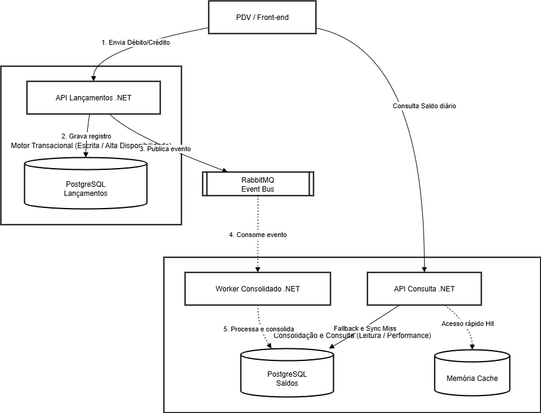
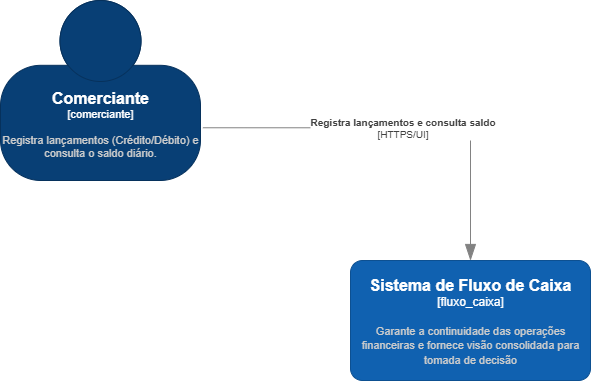
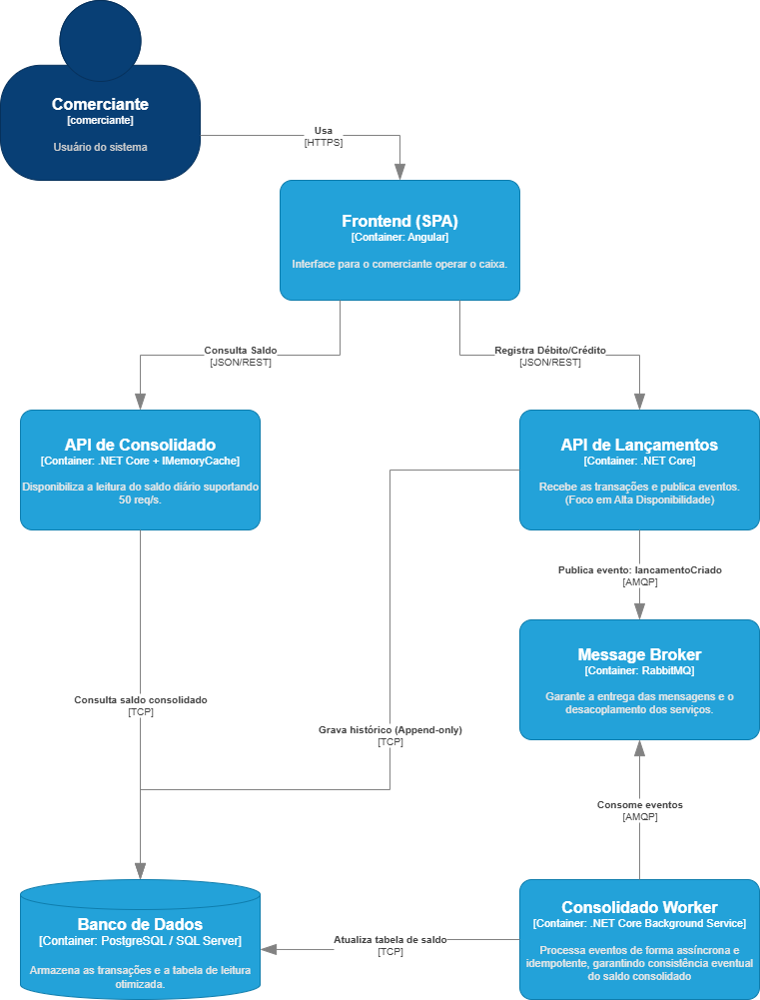

# Sistema de Controle de Fluxo de Caixa

## Visão Executiva

A proposta da arquitetura usa como premissa que a **disponibilidade operacional** do sistema é o foco principal. O uso da separação estratégica entre o domínio transacional (com foco em resiliência) e o domínio de consolidação (com foco em alta performance), garante que a organização nunca perca um registro, mesmo diante de falhas parciais de infraestrutura.

A arquitetura estabelece uma base escalável e orientada a eventos, o que promove a proteção do core business e prepara o código para a evolução contínua e a rápida integração com novas ferramentas.

## Contexto de Negócio
O fluxo de caixa representa o núcleo operacional do varejo. O cenário base endereça uma falha arquitetural comum no setor: a indisponibilidade da frente de caixa (PDV) ocasionada por sobrecarga em serviços analíticos, como a consulta e consolidação de saldos.

O desafio central do projeto é garantir o isolamento do motor de lançamentos (débitos e créditos) para assegurar alta disponibilidade no registro, enquanto viabiliza o consumo de dados consolidados em tempo real. A arquitetura deve suportar picos de acesso de leitura sem onerar a instância de persistência primária e sem impactar o PDV.

## Valor de Negócio Gerado
A arquitetura foi desenhada para garantir a continuidade da operação, mesmo em cenarios de falha do sistema.

Benefícios:

- **Mitigação de perda de vendas**: O módulo de lançamentos opera de forma autônoma e resiliente.
- **Escalabilidade sob demanda**: O sistema de consolidação absorve cargas massivas de leitura sem impactar o core transacional.
- **Resiliência operacional**: Falhas em serviços periféricos não propagam degradação para a operação principal.
- **Base para crescimento**: A separação por domínios permite evolução para novos relatórios e integrações

## Domínios e Capacidades de Negócio

Baseado em princípios de *Domain-Driven Design* (DDD), isolamos a solução em dois contextos delimitados (*Bounded Contexts*):

**1. Contexto de Lançamentos (Operacional / Missão Crítica)**
- **Capacidade:** Registro imutável de fluxo financeiro (débitos e créditos).
- **Direcionador:** Disponibilidade extrema. A frente de loja não pode sofrer latência de processamentos analíticos.

**2. Contexto de Consolidação (Analítico / Apoio à Decisão)**
- **Capacidade:** Apuração e projeção da posição de saldo diário.
- **Direcionador:** Performance de leitura. Absorve a carga de consultas gerenciais sem concorrer recursos com o transacional.

## Justificativas Arquiteturais e Trade-offs

Em sistemas financeiros de missão crítica, a arquitetura deve priorizar o gerenciamento cauteloso e pragmático diante das restrições de infraestrutura. As diretrizes adotadas refletem a preferência pela extrema resiliência do caminho crítico de transação (Write-Path).

**1. Adoção da Stack Tecnológica (.NET / C#)**
- **Racional:** Optamos pelo .NET 9 devido ao seu alto throughput de I/O e segurança de tipos. Em serviços financeiros, a robustez do compilador e a precisão decimal são essenciais para evitar falhas silenciosas que costumam ocorrer em runtimes dinâmicos sob carga.
- **Custo Operacional Associado:** *Footprint* de memória em inatividade (*idle*) levemente superior quando comparado a serviços equivalentes em Go, exigindo alocação base um pouco maior nos *containers* (Pods).

**2. Resiliência baseada em Mensageria (RabbitMQ)**
- **Racional:** Escolhemos o RabbitMQ pela sua simplicidade operacional e suporte nativo a padrões de retry e DLQ. Ele atua como um sistema de supressão (*backpressure*), permitindo que a API de lançamentos libere o cliente instantaneamente enquanto o processamento pesado ocorre em segundo plano.
- **Alternativa Avaliada (Kafka):** Optamos por não utilizar o Kafka para evitar a complexidade de gerenciar um cluster distribuído (ZooKeeper/KRaft), uma vez que o RabbitMQ atende plenamente nosso volume de roteamento transiente.
- **Risco Assumido e Mitigado:** O uso de filas introduz o risco de represamento de mensagens em caso de falha no consumidor. Mitigamos isso com roteamento *Dead Letter Exchange* (DLX) e monitoramento de *backlog*.

**3. CQRS e Consistência Eventual**
- **Racional:** Isolamos fisicamente os vértices de Escrita e Leitura para evitar concorrência de recursos (*table locks*) durante consultas pesadas. Isso garante que o motor de faturamento nunca dispute IO com relatórios analíticos.
- **Trade-off Tolerado:** Aceitamos o paradigma de consistência eventual (replicação assíncrona). Priorizamos a rapidez do PDV em detrimento da sincronização imediata do balanço gerencial.

**4. Performance via Local Cache**
- **Racional:** Implementamos cache em memória na camada de consulta para garantir tempos de resposta constantes (< 50ms), poupando a base de dados de requisições repetitivas.
- **Trade-off Tolerado:** Em cenários de escala horizontal, pode ocorrer um delta temporário entre instâncias (cache staleness). Aceitamos esse risco para manter a infraestrutura simples até que o volume exija um cluster Redis distribuído.

## Escalabilidade e Resiliência

- **Degradação Graciosa:** Se o sistema de saldos cair, o PDV continua vendendo. Os eventos ficam represados no RabbitMQ.
- **Idempotência:** O sistema reconhece e ignora eventos duplicados gerados por retentativas de rede, evitando erros de saldo duplicado.
- **Concurrency Control:** O Worker opera com limites de concorrência controlados para preservar a integridade do banco de dados analítico.

- **Estratégia de Coreografia:** Optou-se por não utilizar orquestradores centrais de transação (padrões complexos como Sagas centralizadas). O serviço emissor apenas publica o evento no barramento (*Message Published*) e encerra o seu ciclo de processamento. A partir desse ponto, o serviço consumidor (*Listener*) assume a responsabilidade de interpretar e processar os dados isoladamente.

## Qualidade e Estratégia de Testes

Nossa confiança na estabilidade financeira reside na **Validação de Infraestrutura Real**, evitando falsos positivos comuns em ambientes mockados.

- **Domínio e Lógica (Unit Tests)**: Foco rigoroso nas invariantes de negócio e regras de cálculo do *Core Domain*.
- **Integração com Postgres/Rabbit (Integration Tests)**: Utilizamos **Testcontainers** para subir instâncias reais de banco e mensageria durante os testes. Isso garante que o código se comporte exatamente da mesma forma no teste e na produção.
- **Caminho Crítico (E2E Tests)**: Automatizamos a simulação do fluxo de ponta a ponta: do registro na API de Lançamentos até a confirmação da redução de balanço no Dashboard, validando a integração completa da cadeia.
- **Idempotência Técnica**: Testamos explicitamente cenários de reentrega de eventos para garantir que o saldo nunca seja afetado por falhas de rede ou duplicidade de mensagens.

## Visão de Custos e FinOps (Azure)

A escolha de componentes seguiu uma estratégia de baixo TCO. Para suportar as 50 req/s, foi adotado o cache em memória, reduzindo o custo e a complexidade de manter um cluster mais complexo, permitindo um custo inicial estimado em **~US$ 190.00/mês** usando Azure (AKS + PostgreSQL + Service Bus).


## Segurança

- Autenticação via OAuth2/JWT
- Criptografia (HTTPS/TLS)
- Processamento idempotente para evitar duplicidade quando há retry ou reentrega de mensagens
- Logs auditáveis para rastreabilidade financeira

## Desenho da Arquitetura e Fluxo de Dados

Para facilitar o entendimento direto da topologia técnica e do isolamento adotado, modelamos o fluxo evidenciando a separação entre o motor de lançamentos (escrita) e a consolidação de saldo (leitura).

### Topologia de Execução (CQRS & Event-Driven)



### Ciclo de Vida da Transação (Fluxo de Funcionamento)

O ecossistema atua de forma estritamente unidirecional. O trajeto de um lançamento financeiro, desde o ponto de venda até o relatório consolidado, obedece a cinco estágios bem definidos:

1. **Ingestão na Borda Externa:** O PDV envia o comando da transação financeira via REST. A API Transacional valida a assinatura, a autenticação JWT e a integridade da estrutura JSON. Se a requisição for inválida, é imediatamente rejeitada, protegendo o limite do sistema.
2. **Persistência Bruta (*Write-Path*):** A API Transacional salva a ordem de faturamento no repositório primário (PostgreSQL). Esta operação foca apenas no armazenamento veloz e sequencial da intenção do faturamento, sem processar lógicas de agregação matemática.
3. **Publicação no Barramento:** Imediatamente após a persistência, a API publica uma notificação segura no RabbitMQ, embutida em um *Integration Event*. Em seguida, retorna uma confirmação HTTP 201 (Created) para o PDV, liberando o terminal físico instantaneamente.
4. **Reatividade Assíncrona (*Worker*):** De forma paralela e independente, o *Worker Consolidador* consome o evento depositado na fila. Ele realiza as agregações financeiras e executa a persistência final no banco destinado exclusivamente para leitura e relatórios.
5. **Apuração Gerencial (*Read-Path*):** Quando ocorre o consumo do balanço através da aplicação gerencial, a requisição é interceptada pela API de Consulta. O saldo diário é extraído instantaneamente do *In-Memory Cache*. O banco de dados físico de relatórios só é acionado na ocorrência de um *Cache Miss* (expiração da memória).

### Documentação C4 Model (Estática)
Como documentação de apoio mais formal, mantemos os recortes nos níveis convencionais do C4 Model:

- **Nível 1: Contexto do Sistema**
  

- **Nível 2: Containers**
  

## Decisões Arquiteturais (ADRs)
Para atender aos requisitos, algumas escolhas estratégicas foram tomadas:

 - [**Arquitetura Orientada a Eventos (EDA)**](./docs/adrs/001-arquitetura-eda.md): A API de Lançamentos faz a comunicação com o consolidado via AMQP (Fila). Garantindo que, se o consolidado cair, o PDV continua registrando o fluxo normalmente. 

 - [**Estratégia de Cache em Memória**](./docs/adrs/002-estrategia-de-cache.md): Para suportar 50 requisições por segundo na consulta de saldo, foi adotado o uso de cache em memória com TTL baixo. Com isso evitamos chamadas excessivas ao banco de dados e reduzimos a complexidade de ter um cluster de cache distribuído, reduzindo os custos e infraestrutura.

 - [**CQRS (Command Query Responsibility Segregation) Lógico**](./docs/adrs/003-separacao-de-leitura-e-escrita.md): Separação clara da modificação de estado (Lançamentos do PDV) e a consulta de saldos (Consolidado).


## Arquitetura de Transição (Migração)
Caso esta arquitetura vise substituir um monolito legado, a adoção do padrão Strangler Fig garante a transição contínua.

A estratégia envolveria a implantação das bases de dados em paralelo, seguida de uma carga inicial (sincronização de estado). Um API Gateway assumiria o papel de roteador, direcionando o tráfego do PDV gradativamente para os novos microsserviços de lançamentos, enquanto o monolito segue respondendo pelas capacidades não migradas. A desativação do módulo correspondente no legado ocorreria apenas após rigorosa validação da integridade contábil no novo consolidador, bloqueando o risco de perdas financeiras.

## Como Executar o Projeto Localmente
Foi utilizado o Docker para facilitar a execução sem a necessidade de instalar dependências no host e facilitar o uso de tecnologias Cloud ou On-Premise.

**Pré-requisitos:** * Docker e Docker Compose instalados.
* Node.js (versão 18 ou superior) e NPM instalados (exigência apenas para rodar a interface web).

### 1. Subir o Backend

```sh
git clone [https://github.com/andersonlazzari/verx-challenge.git](https://github.com/andersonlazzari/verx-challenge.git)

cd verx-challenge

docker-compose up -d --build
```

### 2. Subir o Frontend

```sh
cd fluxo-caixa-ui
npm install
npm start
```

### 3. Acessar a Aplicação

- **Frontend**: http://localhost:4200
- **Swagger (API de Lançamentos)**: http://localhost:5000/swagger
- **Swagger (API de Consolidado)**: http://localhost:5001/swagger
- **RabbitMQ Management**: http://localhost:15672 (usuário: guest, senha: guest)


## Evolução Arquitetural (Roadmap)

A linha de base atual resolve o gargalo crônico do isolamento entre recebimento transacional e apuração analítica. Tendo a garantia operacional fixada, estabelecemos os seguintes avanços programados visando suportar a expansão elástica sistêmica:

- **Observabilidade Estruturada e Tracing Distribuído:** Substituição dos logs textuais locais por uma malha centralizadora (via OpenTelemetry). Isso garantirá rastreio contínuo desde a entrada REST até o processamento no *Worker*, rastreando o percurso do fluxo financeiro.

- **Transição Orientada a Cache Distribuído:** Durante expansão horizontal do serviço de consolidação, a retenção restrita (*In-Memory Cache*) evoluirá para a abordagem distribuída (clusterização baseada em Redis). Esse movimento consolida a uniformidade de estado da aplicação, eliminando desvios isolados (*stale data*) provocados pelo balanceamento de conexões operando paralelo no mesmo instante.

- **Resiliência Estrutural (Circuit Breaker):** Inserção do mecanismo de desarme (*Circuit Breaker Pattern*) na integração com os limites de banco. A meta prática compreende o bloqueio de novas requisições em momento sistêmicos irrecuperáveis (*Fail Fast*), evitando que transações represadas saturem permanentemente as *threads* internas de requisição local.

- **Carga Automatizada em Esteira:** Introdução de injeção pontual destrutiva com apoio de ferramentas de sobrecarga (Padrão k6) diretamente integradas à esteira CI/CD (*Continuous Integration*). Avaliar matematicamente as métricas de tempo de resposta em alto estresse servirá como ponto de aprovação ou reprovação de versões no limite de percentis adequados.
